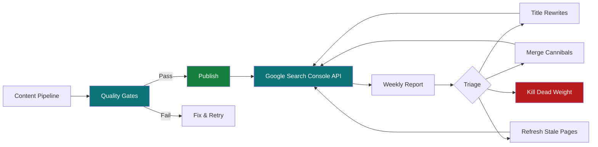

# AI SEO Playbook

[](LICENSE)
[](https://nodejs.org)
[](CONTRIBUTING.md)
[](https://github.com/TraceCohenTech/ai-seo-playbook/stargazers)

**The complete playbook for building an AI-powered content engine that actually ranks — from zero to 4.6M impressions in 3 months.**

This is the methodology, the toolkit, and the hard-won lessons from building a content engine on [ValueAddVC.com](https://valueaddvc.com) using AI agents, GSC feedback loops, and automated quality gates. 14 diagnostic scripts, 9 battle-tested configs (safety guards, agent orchestration, quality gates, anti-AI detection), structured data schemas, and CI automation — everything you need to replicate the system.

Not theory. Not prompts. The actual operating system behind a site that went from 604K to 4.62M monthly impressions.

Built by [Trace Cohen](https://x.com/Trace_Cohen) at [ValueAddVC.com](https://valueaddvc.com).

---

## What This Playbook Covers

1. **The Content Engine** — AI agent orchestration (multi-model pipelines: Opus/Fable for planning, Sonnet for writing, Haiku for grunt work), 5-format content rotation, voice training, anti-AI fingerprint detection
2. **The GSC Feedback Loop** — Weekly automated reports, title rewrite candidates, cannibalization detection, query gap mining, striking distance optimization
3. **The Quality System** — 9 publish gates, template phrase blocklists, source verification, fact-checking, structured data validation
4. **The Safety Layer** — Repo locks, rebase guards, build cost control ([nobuild] tags, deploy-tick), self-healing heartbeats, content writer isolation from git
5. **The Growth Loop** — Keyword anticipation (publish before demand spikes), living page refreshes, internal link graph optimization, news sitemap + WebSub for instant crawling

---

## How It Works



The feedback loop: GSC data feeds diagnostic scripts → scripts surface what needs fixing → AI agents make the fixes through quality gates → improved rankings produce better GSC data → repeat. Every week the system gets smarter.

---

## What's Inside

### Scripts (`/scripts`)

| Script | What It Does |
|--------|-------------|
| `gsc-rewrite-candidates.mjs` | Finds title rewrite opportunities from GSC data — pages ranking position 4–20 with high impressions but low CTR |
| `template-detector.mjs` | Scans your content for AI template fingerprints — the repeated phrases that signal scaled-content-abuse to Google |
| `cannibalization-detector.mjs` | Finds pages on your site competing for the same queries, splitting authority and ranking worse than one consolidated page would |
| `weekly-report.mjs` | Generates a weekly SEO performance report with trending queries, dropping pages, CTR triage candidates, and query monopolies |
| `orphan-finder.mjs` | Finds pages with zero inbound internal links — invisible to Google's link-graph crawler |
| `content-audit.mjs` | Scores every page into KILL / MERGE / UPDATE / PROMOTE / KEEP buckets based on GSC data + content quality |
| `redirect-checker.mjs` | Finds URLs in your sitemap that return 301/302/308 instead of 200 — these break GSC validation and waste crawl budget |
| `refresh-tracker.mjs` | Identifies high-traffic pages that haven't been updated recently — candidates for the "refresh drip" strategy |
| `query-gap-miner.mjs` | The retroactive keyword discovery engine — finds queries with real demand where you have no dedicated page. Google is telling you what to write. |
| `striking-distance.mjs` | Finds pages ranking position 5-20 with real impressions — the cheapest wins in SEO. Estimates click gain if improved. |
| `rewrite-measurer.mjs` | Before/after tracking for title rewrites. Take a baseline, make changes, measure impact 2-4 weeks later. |
| `websub-ping.mjs` | Notifies Google's hub that your feeds changed — triggers immediate crawl instead of waiting hours. Run after every publish. |
| `indexing-submitter.mjs` | Submits URLs to Google's Indexing API for near-instant crawling. 200 URLs/day quota. |
| `broken-link-checker.mjs` | Scans all content for outbound links and checks for 404s, timeouts, and redirect chains. Exits non-zero for CI. |

### Configuration (`/config`)

| File | Purpose |
|------|---------|
| `format-rotation.json` | The 5-format content system: Deep Explainer, News Analysis, Ranked List, Question-Led, Contrarian Take — with per-format word counts, chart requirements, and selection weights |
| `quality-gates.json` | Publish gate rules: cannibalization check, source URL verification, template phrase detection, shared closer detection, typecheck |
| `anti-ai-rules.json` | The complete blocklist of AI template phrases + style rules for making AI content sound human |
| `refresh-rules.json` | Rules for the refresh drip strategy — staleness thresholds by content type, refresh triggers, and a refresh checklist |
| `keyword-anticipation.json` | Event calendar methodology — publish content before IPOs, earnings, funding rounds, regulations so you're ranked when demand spikes |
| `health-checks.json` | Live-site health checks: leaked template variables, broken OG images, injected ad links, thin content, dead pages |
| `content-pipeline-guards.json` | Safety guards: repo locks, rebase guards, cannibalization checks, build cost control, self-healing heartbeats |
| `agent-orchestration.json` | Multi-model AI pipeline rules: Opus/Fable for planning, Sonnet for writing, Haiku for mechanical tasks. Max 3 concurrent agents. |

### Schema Examples (`/schemas`)

| File | Schema Type |
|------|------------|
| `article-with-author.json` | Article + Person author entity (the E-E-A-T foundation) |
| `faq-page.json` | FAQPage for blog posts — drives FAQ rich results |
| `item-list.json` | ItemList for ranking/comparison pages — the format sponsors want |
| `news-article.json` | NewsArticle + news sitemap template for real-time content |

### Examples (`/examples`)

- `sitemap.ts` — Next.js dynamic sitemap with honest lastmod dates
- `news-sitemap.ts` — 48-hour rolling news sitemap for Google News/Discover
- `internal-link-component.tsx` — React component for related posts + a build-time internal link inserter
- `vercel-ignore.sh` — Build skip logic for Vercel: [nobuild] tags, content-only detection, deploy-tick pattern (saves $$$)

### Sample Output (`/samples`)

Every script has a sample output file so you can see what to expect before running anything:

- `weekly-report.json` — Full weekly report with trending queries, dropping pages, CTR triage
- `rewrite-candidates.json` — Title rewrite opportunities with per-query diagnosis
- `content-audit.json` — KILL/MERGE/UPDATE/PROMOTE/KEEP bucket assignments
- `cannibal-clusters.json` — Cannibalization clusters with wasted impression estimates
- `template-scan.json` — AI fingerprint scan with per-file phrase locations
- `orphan-pages.json` — Orphan, low-link, and dead-end page reports

### Documentation (`/docs`)

- [`setup-gsc.md`](docs/setup-gsc.md) — Step-by-step Google Search Console API setup (local auth + service account for CI)

### Automation (`.github/workflows`)

- `weekly-seo-report.yml` — GitHub Action that runs the weekly report every Sunday, commits results, and optionally creates a GitHub issue with the summary

---

## Quick Start

```bash
# Clone the repo
git clone https://github.com/TraceCohenTech/ai-seo-playbook.git
cd ai-seo-playbook

# Install dependencies
npm install

# Set up Google Search Console API access
# (requires a Google Cloud project with Search Console API enabled)
gcloud auth application-default login \
  --scopes=https://www.googleapis.com/auth/webmasters.readonly

# Find title rewrite opportunities
npm run rewrite-candidates -- --site sc-domain:yoursite.com

# Scan for AI template fingerprints
npm run template-scan -- --dir ./your-content-directory

# Find cannibalization clusters
npm run find-cannibals -- --site sc-domain:yoursite.com

# Run a full content audit
npm run content-audit -- --site sc-domain:yoursite.com --dir ./your-content-directory

# Find orphan pages (no internal links)
npm run find-orphans -- --dir ./your-content-directory

# Generate weekly report
npm run weekly-report -- --site sc-domain:yoursite.com

# Discover keywords you're already ranking for but have no page targeting
npm run query-gaps -- --site sc-domain:yoursite.com --dir ./your-content-directory

# Find "almost page 1" pages where a small nudge = big click gains
npm run striking-distance -- --site sc-domain:yoursite.com

# Find stale pages that need refreshing
npm run refresh-tracker -- --site sc-domain:yoursite.com --dir ./your-content-directory

# Check for redirect problems in your sitemap
npm run check-redirects -- --site sc-domain:yoursite.com --sitemap https://yoursite.com/sitemap.xml

# Ping Google to crawl your updated feeds immediately
npm run websub-ping -- --feeds https://yoursite.com/sitemap.xml,https://yoursite.com/feed.xml
```

> **New to the GSC API?** See [`docs/setup-gsc.md`](docs/setup-gsc.md) for a step-by-step setup guide.

---

## The Playbook

These tools are one half of the system. The methodology — why these specific metrics matter, how to interpret the results, and how to build the feedback loop that makes your content engine self-improving — is in the full guide:

**[The AI SEO Playbook: How I Used AI to Build a Content Engine That Hit 4.6M Impressions in 3 Months](https://valueaddvc.com/seo-playbook)**

The guide covers:
- Building the content engine (architecture, voice training, format rotation)
- The GSC reckoning (the AI-overview discovery, title rewrites, cannibalization)
- The iteration loop (keyword anticipation, living pages, technical SEO bugs)
- The system (quality gates, weekly reviews, cost control)

---

## Results

These tools were built and refined on [ValueAddVC.com](https://valueaddvc.com) over 3 months:

| Metric | Week 1 (May '26) | Now (Aug '26) |
|--------|-------------------|---------------|
| 3-Month Impressions | — | 4.62M |
| 3-Month Clicks | — | 17.3K |
| Daily Clicks (peak) | ~50 | 854 |
| Average Position | 12+ | 7.5 |
| CTR | 0.93% | 0.4% |
| Posts Audited | 480 | 960+ |
| Title Rewrites | 0 | 92 |
| Cannibalization Clusters Fixed | 0 | 21 |
| Template Phrases Purged | 500+ | 0 |
| Orphan Pages Linked | 0 | 191 |

*\*CTR is 0.4% because impressions grew ~8x — largely from AI-overview citations (GEO traffic) that don't produce clicks by nature. Human-intent CTR improved: ranked lists hit 6.8%, question-led posts hit 3.2%. The growth curve is near-vertical: Aug 13 alone hit 127K impressions and 854 clicks.*

---

## How to Set Up the Weekly Cron

### Option 1: GitHub Actions (recommended)

1. Create a Google Cloud service account with Search Console API access
2. Add the service account JSON as a GitHub secret named `GSC_CREDENTIALS`
3. Set the repository variable `GSC_SITE` to your GSC property (e.g., `sc-domain:yoursite.com`)
4. Set `CONTENT_DIR` to your content directory path (e.g., `./src/app/blog`)
5. Optionally set `CREATE_ISSUES` to `true` for weekly GitHub issue summaries
6. The workflow runs every Sunday at 9:30 AM ET automatically

### Option 2: Local cron (macOS launchd)

```bash
# Create a plist in ~/Library/LaunchAgents/
# Schedule: every Sunday at 9:30 AM
# Script runs: node scripts/weekly-report.mjs --site sc-domain:yoursite.com
# Commits results to git
```

### Option 3: Any CI/CD system

The scripts are standalone Node.js — run them anywhere you can install `googleapis` and authenticate with Google Cloud.

---

## Project Structure

```
ai-seo-playbook/
├── scripts/              # 14 diagnostic & tracking scripts
│   ├── weekly-report.mjs            # Weekly GSC performance report
│   ├── gsc-rewrite-candidates.mjs   # Find title rewrite opportunities
│   ├── rewrite-measurer.mjs         # Before/after rewrite tracking
│   ├── query-gap-miner.mjs          # Retroactive keyword discovery
│   ├── striking-distance.mjs        # Position 5-20 opportunities
│   ├── template-detector.mjs        # Scan for AI template phrases
│   ├── cannibalization-detector.mjs  # Find competing pages
│   ├── content-audit.mjs            # KILL/MERGE/UPDATE/PROMOTE scoring
│   ├── orphan-finder.mjs            # Find unlinked pages
│   ├── refresh-tracker.mjs          # Stale page detection
│   ├── redirect-checker.mjs         # Sitemap redirect problems
│   ├── broken-link-checker.mjs      # 404s and dead outbound links
│   ├── websub-ping.mjs              # Notify Google of feed changes
│   └── indexing-submitter.mjs       # Google Indexing API submissions
├── config/               # Quality gates, format system, anti-AI rules
├── schemas/              # JSON-LD structured data examples
├── examples/             # Next.js sitemaps + React components
├── samples/              # Example output from every script
├── docs/                 # Setup guides
└── .github/workflows/    # Weekly automated report CI
```

---

## Contributing

Found a template phrase pattern that should be in the blocklist? A better heuristic for the content audit scorer? See [CONTRIBUTING.md](CONTRIBUTING.md) for how to submit changes.

There's even a dedicated issue template for [submitting new template phrases](https://github.com/TraceCohenTech/ai-seo-playbook/issues/new?template=template_phrase.yml) — the blocklist is never complete.

---

## Built On

This toolkit was built and battle-tested on [ValueAddVC.com](https://valueaddvc.com) — a venture capital content platform that went from 604K monthly impressions to 4.62M in 3 months using these exact scripts and methodology.

| | May 2026 | August 2026 |
|---|---|---|
| **Daily clicks** | ~50 | **854** (peak) |
| **Position** | 12+ | **7.5** |
| **Template phrases** | 500+ | **0** |
| **Orphan pages** | 191 | **0** |

The full methodology is in the companion guide: **[The AI SEO Playbook](https://valueaddvc.com/seo-playbook)**

---

## License

MIT

---

Built by [Trace Cohen](https://x.com/Trace_Cohen) · [ValueAddVC.com](https://valueaddvc.com) · [t@nyvp.com](mailto:t@nyvp.com)
